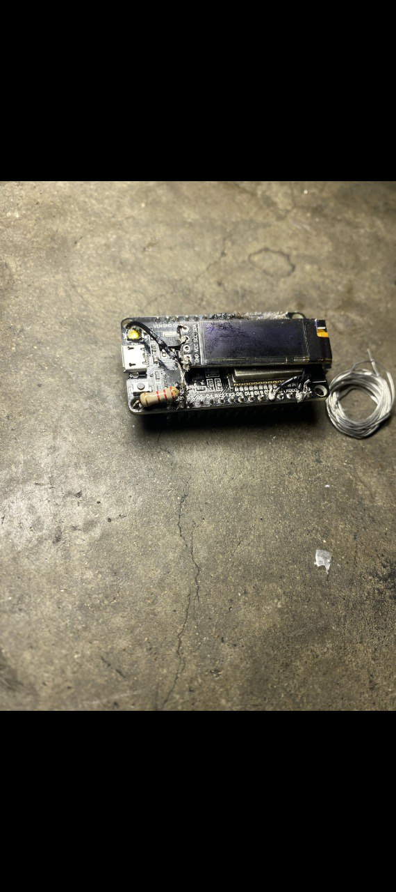

  

# smartHUDglasses

## Overview
A clip-on heads-up display system designed to augment any standard pair of glasses with real-time visual information overlay. Built using ESP32 microcontroller and wave display technology with a reflective micro-mirror system for seamless integration into the user's field of view.
Core Features
Visual Display System

Clip-On Design: Universal attachment mechanism compatible with most eyeglass frames
Micro-Mirror Projection: Compact reflective display mounted within the lens area
Wave Display Technology: Low-power screen optimized for outdoor visibility
Transparent Overlay: Information appears without obstructing natural vision

Recognition & Analysis Capabilities

Facial Recognition: Real-time face detection with profile matching against stored database
Profile Display: Instant HUD overlay showing matched individual's information including name, known affiliations, previous interaction history, and relevant context
Object Identification: Recognizes and labels common objects, tools, vehicles, and landmarks within view
Scene Analysis: Environmental awareness including crowd density, room layout, and situational context assessment
Text Recognition: OCR for signs, documents, labels, and digital screens in environment

Audio Processing

Ambient Listening: Directional microphone array for conversation capture
Voice Isolation: Filters and enhances specific audio sources in noisy environments
Speech-to-Text: Real-time transcription of conversations displayed on HUD
Audio Analysis: Tone detection, sentiment analysis, and speaker identification
Translation: Multi-language support with live subtitle overlay

Interaction Modes

Gesture Control: Head movement and eye-tracking for hands-free navigation
Voice Commands: Activate functions through discrete verbal inputs
Mobile Integration: Companion app for configuration and data synchronization
Alert System: Visual and audio notifications for flagged individuals or situations

Technical Specifications
Hardware

Processor: ESP32 dual-core microcontroller with WiFi/Bluetooth
Display: OLED/E-ink wave display (resolution optimized for HUD viewing distance)
Camera: High-resolution forward-facing camera with wide-angle lens
Microphone: Dual MEMS microphones with noise cancellation
Power: Rechargeable lithium battery (estimated 6-8 hour runtime)
Sensors: Accelerometer, gyroscope for motion tracking and display stabilization
Connectivity: WiFi 802.11 b/g/n, Bluetooth 5.0

Software Architecture

Operating System: FreeRTOS on ESP32
Computer Vision: OpenCV-based facial and object recognition
Machine Learning: TensorFlow Lite models for edge inference
Database: Local SQLite for profile storage with cloud sync capability
Encryption: End-to-end encrypted data transmission and storage
API Integration: RESTful services for cloud processing and updates

Use Cases
Professional Applications

Security Personnel: Rapid identification of authorized individuals and flagged persons
Healthcare Providers: Patient information display during rounds
Customer Service: Instant access to client profiles and interaction history
Researchers: Field data collection with contextual note-taking

Personal Applications

Social Networking: Remember names and details from previous meetings
Navigation: Augmented reality directions and location tagging
Accessibility: Visual and audio assistance for impaired individuals
Language Learning: Real-time translation during conversations

Privacy & Security
Data Protection

All biometric data stored locally with optional encrypted cloud backup
User-controlled data retention policies
Automatic data purging options
Secure boot and firmware signing

Compliance Features

Recording indicator LED (non-defeatable)
Consent logging for captured interactions
GDPR and privacy law compliance modes
Data access audit trails

Development Status
Completed Components

ESP32 firmware framework
Display driver and mirror optics system
Basic facial detection algorithm
Clip-on mechanical design

In Progress

Profile matching optimization
Audio processing pipeline
Power management system
Mobile companion application

Future Enhancements

Multi-camera stereoscopic vision
AR waypoint navigation
Thermal imaging integration
Extended battery modules
Prescription lens compatibility

Installation & Setup
Hardware Assembly

Attach clip-on module to glasses frame temple
Adjust mirror angle for optimal HUD positioning
Connect charging cable to micro-USB port
Power on device using side button

Software Configuration

Install companion mobile app
Pair glasses via Bluetooth
Complete calibration routine (eye position, focus distance)
Configure recognition databases and alert preferences
Set privacy and recording preferences

Technical Challenges & Solutions
Power Consumption

Implemented aggressive sleep modes between recognition events
Optimized display refresh rates
On-device ML inference to reduce wireless transmission overhead

Processing Limitations

Edge computing approach with cloud fallback for complex analysis
Pre-trained lightweight models for real-time performance
Selective high-resolution capture only when necessary

Form Factor

Minimalist design prioritizing weight distribution
Modular battery placement options
Adjustable mounting for different frame geometries

Disclaimer
This device is intended for authorized and lawful use only. Users are responsible for compliance with all applicable laws regarding recording, surveillance, and data privacy in their jurisdiction. Unauthorized surveillance or recording may violate privacy laws and regulations.
